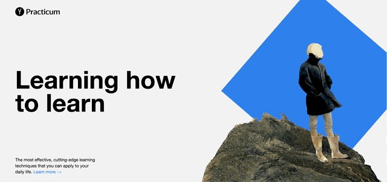

# Learning how to learn - Web Project 1

## Project description

This is my first Web Project for the Practicum Web Development bootcamp. It's a basic non-responsive web page called 'Learning how to learn' that provides useful tips and facts on learning techniques. The page is created with only HTML and CSS (including Flexbox and CSS animations), and the BEM methodology has been applied to structure both CSS and project files.

## [**View live project**](https://denisehung.github.io/web_project_1/) :rocket:

## Technologies

- HTML
- CSS
- Flexbox
- BEM

## Plans for finalizing the project

- Adding different fonts
- Adding my favorite educational videos
- Checking the code for cross-compatibility and adding all the necessary vendor prefixes
- Designing a form that allows users to submit a comment

## Getting started

```bash
# Clone repository
$ git clone https://github.com/denisehung/web_project_1.git
# Navigate to project directory
$ cd web_project_1
```

## Images

